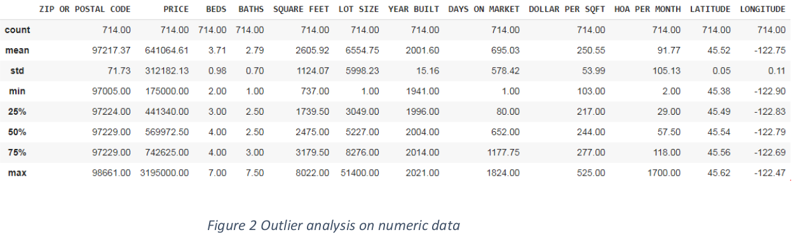
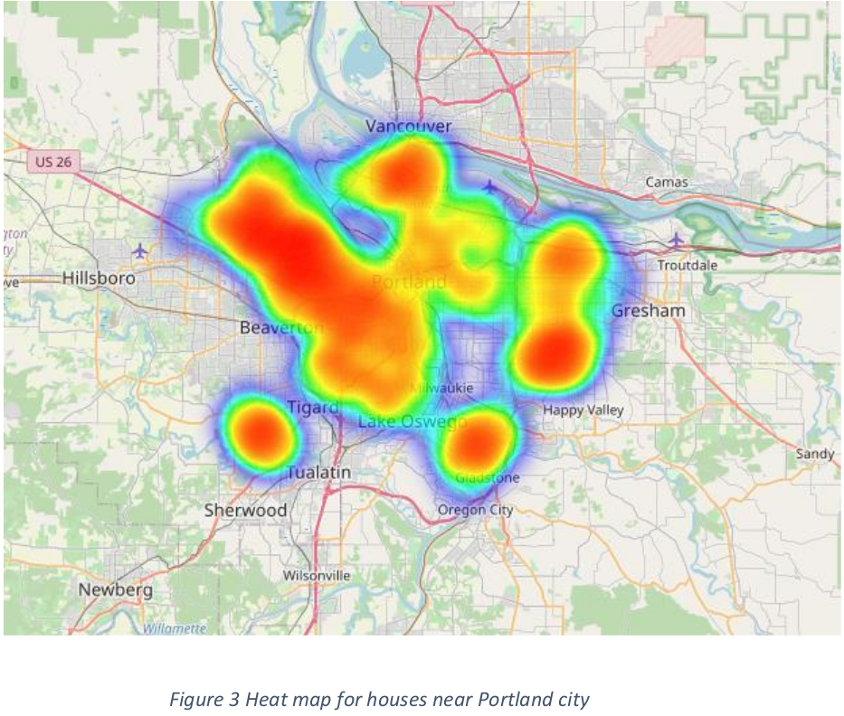
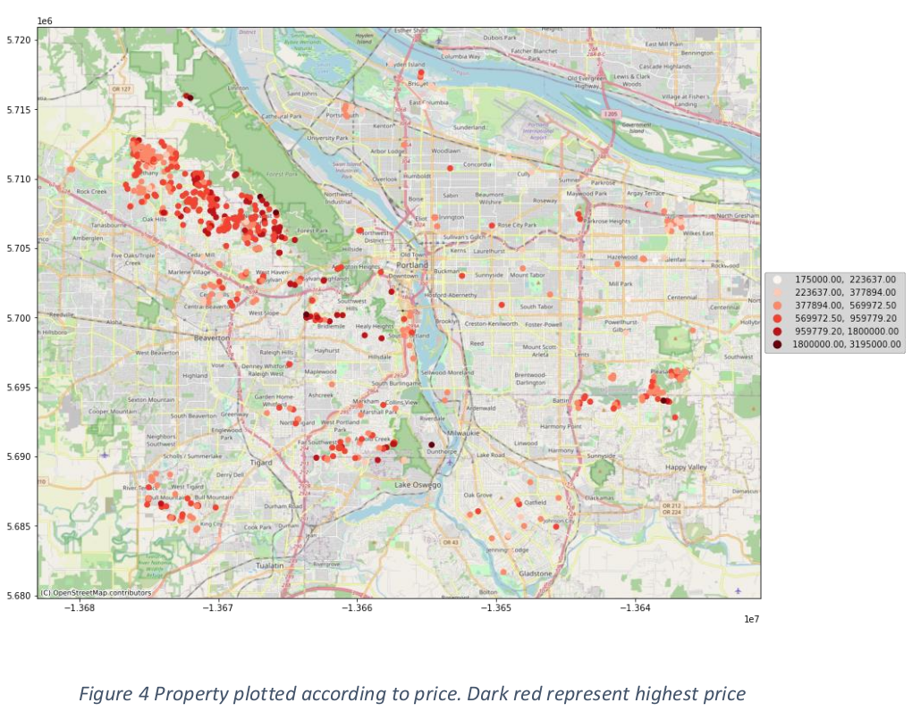
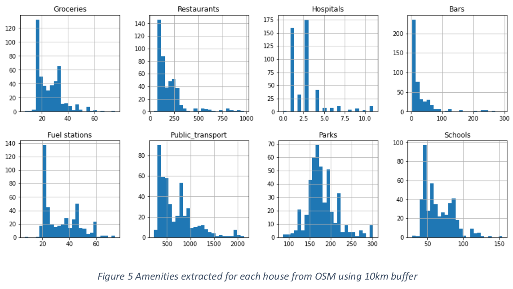
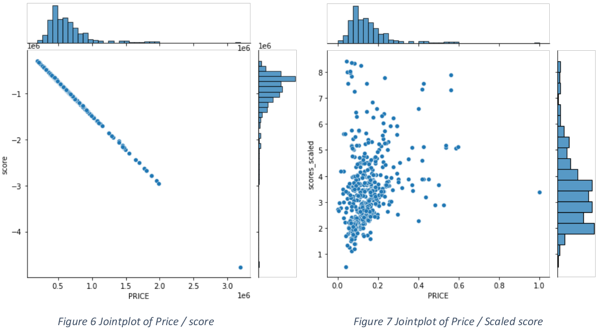
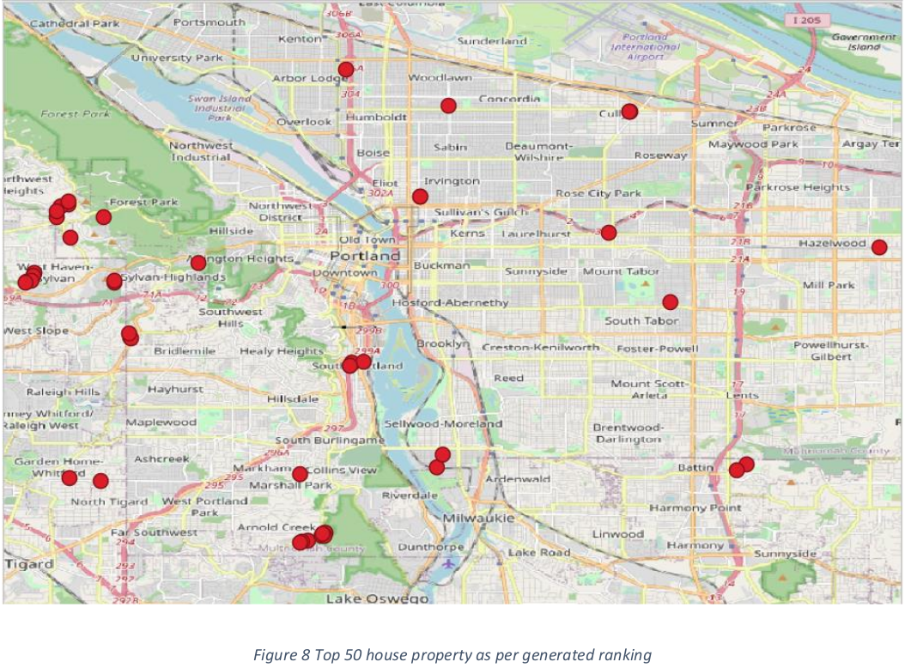
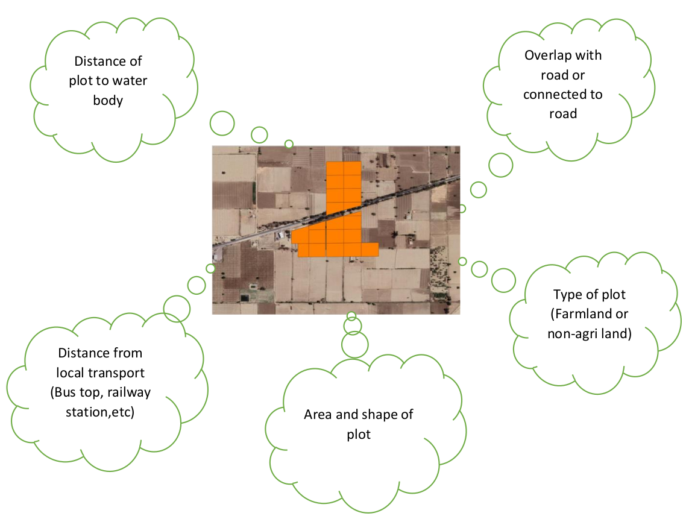

# Location-Based-Intelligence

## Objectives
1. The key factor that will be important is that the location should either be currently undervalued/ display strong potential to appreciate in the next 
few years
2. Find out locations that are suitable for Real Estate Investment
3. Visualizing the insights and creating pdf report
## Optional
- Build ML models to predict location-based prices.
- Choose alternate data sources like satellite imagery,etc.

## Study Area – Portland City
</img>

## Methodology
The methodology is divided into 4 parts each part has is coded in different notebook file mentioned. The notebook files are attached in the folder can be
used as per convenience.

## Location Based Intelligence Part 1
Part 1 - [part1.ipynb](https://github.com/Dimplejain23/Location-Based-Intelligence/blob/main/part1.ipynb) 

- <b> Data download </b>- The data was downloaded from https://www.redfin.com/ which is a full-service real estate brokerage. They cover majority of US 
states and counties. The data was downloaded for Portland County for active properties to be sold plus the sold property over last 3 years. The selection 
is done manually on the website and the website returns 350 homes per request. But by making changes in the api call I was able to get around 10000 homes
per request.
- <b> Cleaning the dataset </b>– Dataset was cleaned to remove any Nan or missing values, to remove or drop columns not required in further analysis and 
also some column names consisting special characters were renamed. Outlier Analysis was used to find any outlier values in any columns which will create 
discrepancy in the data.

</img>

## Location Based Intelligence Part 2
Part 2 - [part2.ipynb](https://github.com/Dimplejain23/Location-Based-Intelligence/blob/main/part2.ipynb)

- <b>Visualization</b> – The data was first converted from a non-spatial data to spatial data using the LATITUDE and LONGITUDE columns and using Geopandas 
Python library. A heat map was also generated to find out the concentration of points over the location. This spatial data was then plotted over OSM base 
map to  get a good idea how our data varies over the region.

</img>

</img>

## Location Based Intelligence Part 3
Part 3 - [part3.ipynb](https://github.com/Dimplejain23/Location-Based-Intelligence/blob/main/part3.ipynb)

- <b>Data Modeling</b> - A sample dataset was taken in which all properties built after year 2000 were only taken. Attributes which influences a buyer to 
buy homes or property were listed and the important 8 attributes data were extracted from the location of each point using OSM (OpenStreet Maps) data. 
These attributes were extracted by created a 10km buffer around each property, as it takes approx. 15- 20mins to cover a distance of 10km. This additional 
data  was added to the sample data by adding extra columns. The additional factors which influencing a buyer while purchasing a property are as follows.
  - Groceries (Marketplace)
  - Restaurants
  - Hospitals
  - Bars
  - Fuel stations
  - Public_transport (Bus stops)
  - Parks (Garden)
  - Schools
  
</img>

## Location Based Intelligence Part 4
Part 4 - [part4.ipynb](https://github.com/Dimplejain23/Location-Based-Intelligence/blob/main/part4.ipynb)

- <b> Grading / Ranking Properties </b> – Weightages were given to each attribute which also implies their importance while generating score. This is a 
manual process of modelling, for automatic generation of weights you can also take user preferences data in consideration and create a model using ML 
(Machine Learning) methods. The weightage also consist negative value multiplied to attribute like Price as more high the price less the priority. The 
values of the important column were added to create a score. After generating the score a joint plot was plotted for house prices and score generated, 
where it seems that larger value column like prices of property was having an improper influence on the scores. Hence then the data was scaled and scores 
were generated again, when a join plot was plotted for prices and scaled score the distribution seemed normal. Then the data was sorted descending 
according to the scores and then the index were reset. Then column called rank was created in which value of index were added, such that 1 rank will have 
highest score and then so on. Then top 50 properties were plotted on a basemap to view their location and data was saved as Geojson to view it in any GIS 
software.

</img>

## Location Based Intelligence
</img>

<b> Raw - Data used </b>- [redfin_2021-09-04-10-40-37.csv](https://github.com/Dimplejain23/Location-Based-Intelligence/blob/main/content/redfin_2021-09-04-10-40-37.csv)

## Additions
The above methodology shows how to find location for property suitable for Real Estate Investment. But the above example shows how to find those properties 
in urban location. If we want to find property like a piece of land or a plot over rural areas, following are the things to be taken care of. This can be 
used for future case study.
</img>
